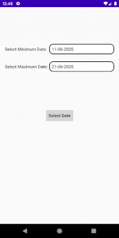

# Android Custom Datepicker

A Custom datepicker control built for developing Android apps.

# Table of contents
- [Description](#description)
- [Demo](#demo)
- [Usage](#usage)
- [Detailed Explaination](#detailed-explaination)
- [Want to Contribute?](#want-to-contribute)
- [Need Help?](#need-help)
- [Collection of Components](#collection-of-components)
- [Changelog](#changelog)
- [License](#license)
- [Keywords](#keywords)

### Description
This is a Custom datepicker control build in Android. Feel free to use and customize this control based on the theme / UI UX of your Android app. 

## Demo

## Usage
Copy DatePickerDialogWithMaxMinRange.kt class to your project's java folder.
Then follow the code mentioned in the CustomDatepickerdemo.kt activity class.

## Detailed Explaination
For detailed explaination about the creation of the custom date picker and its usage in the activity, kindly refer to our blog post on technetexperts.com

Follow [this link](https://www.technetexperts.com/mobile/how-to-make-a-custom-datepicker-control-with-maximum-and-minimum-date-range-in-android-application/) to understand the creation of a custom date picker dialog.

Whereas Follow [this link](https://www.technetexperts.com/mobile/how-to-implement-a-custom-datepicker-control-with-maximum-and-minimum-date-range-in-android-application/) to understand how to embed the custom date picker dialog in the activity to get the desired results.

## Want to Contribute?
- Created something awesome, made this code better, added some functionality, or whatever (this is the hardest part).
- [Fork it](https://docs.github.com/en/github/getting-started-with-github/fork-a-repo).
- Create new branch to contribute your changes.
- Commit all your changes to your branch.
- Submit a [pull request](https://docs.github.com/en/pull-requests).

## Need Help?
We also provide a free, basic support for all users who want to use this Custom Datepicker in your Android project. In case you want to customize this Datepicker to suit your development needs, then feel free to contact our [Android developers](https://www.weblineindia.com/hire-android-app-developers.html).

## Collection of Components
We have built many other components and free resources for software development in various programming languages. Kindly click here to view our [Free Resources for Software Development](https://www.weblineindia.com/software-development-resources.html).

## Changelog
Detailed changes for each release are documented in CHANGELOG.md.

## License
[MIT](https://github.com/weblineindia/Android-Custom-Datepicker/blob/master/LICENSE)

## Keywords
DatePicker, Custom Control, Custom Date Picker, Picker Dialog, Custom Dialog